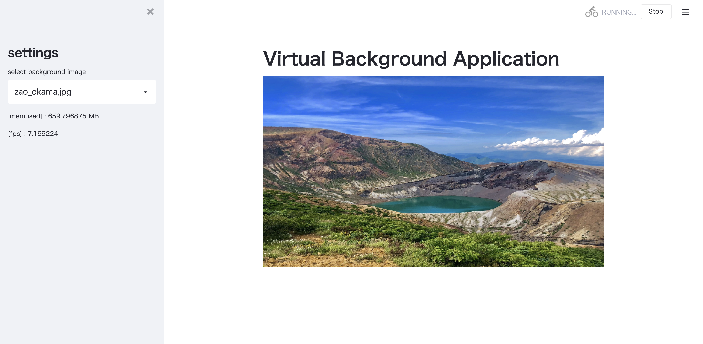

# Virtual Background Application Running on CPU

### you can access web application version: https://share.streamlit.io/mitsuhiko-nozawa/virtual_background/main/app/rtc_app.py
</br>

### 内蔵カメラの権限の影響で、VSCodeなどからではなく直接ターミナルから起動してください

## 0. Clone repositry
```
git clone https://github.com/mitsuhiko-nozawa/virtual_background.git
cd virtual_background
```

## 1. install pyenv
```
# zsh example

# pyenv
git clone https://github.com/pyenv/pyenv.git ~/.pyenv
echo 'export PYENV_ROOT="$HOME/.pyenv"' >> ~/.zshrc
echo 'export PATH="$PYENV_ROOT/bin:$PATH"' >> ~/.zshrc
exec "$SHELL"
```

## 2. make environment and install library using poetry
```
pyenv install 3.7.5
pyenv virtualenv 3.7.5 virtual_bg
pyenv local virtual_bg
pip install poetry
poetry install 
```

## 3. running application!
```
sh serve_app.sh
```
</br>

# Specification 
### 動作環境
- macOS : 10.15.x (Catalina, Mojaveでは動きませんでした)
- Ubuntu : 18.04, 20.04
- CentOS : 7.4
- Windows : 10

### モデル
- Pytorch ESPNet (https://arxiv.org/pdf/1803.06815.pdf)
- -> ONNX
- -> openvino

### Dataset
- Pascal VOC 2012 (http://host.robots.ox.ac.uk/pascal/VOC/voc2012/) 

### Back Ground Picture
- They are my property, so no license

### FPS
- normal : 3.x ~ 4.x
- asynchronized : 6.x ~ 7.x
- ※おそらく動作環境によって異なります

</br>

# Parse movie
### 1. set your movie in ./movies
### 2. excute command
```
python parse_movie.py <your file>
```
you can check \<your file\> directory is generated in ./background


</br>

# User Interface

- you can change background image between five landscapes
- can monitor memory usage and frame per second

</br>

# Sample Movie

